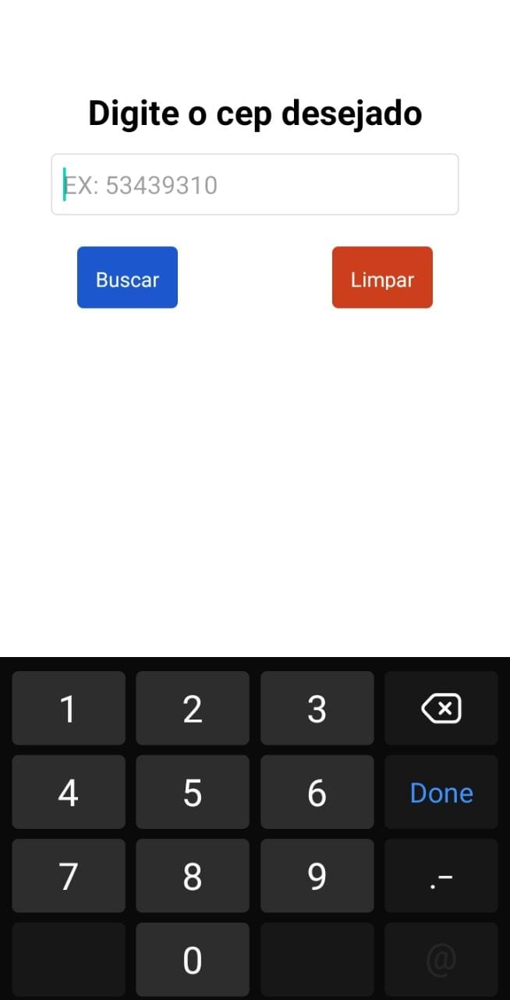
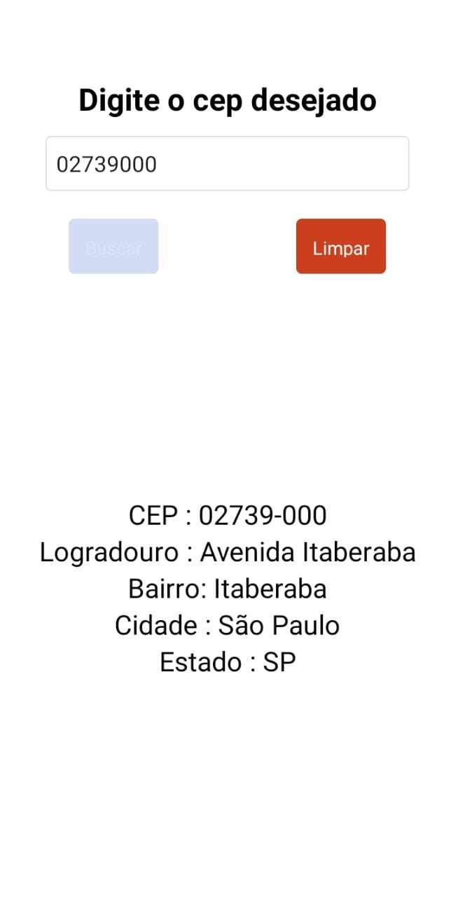
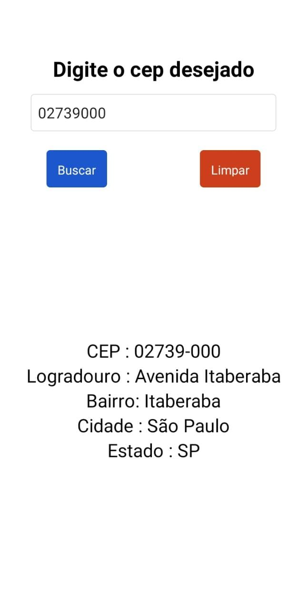
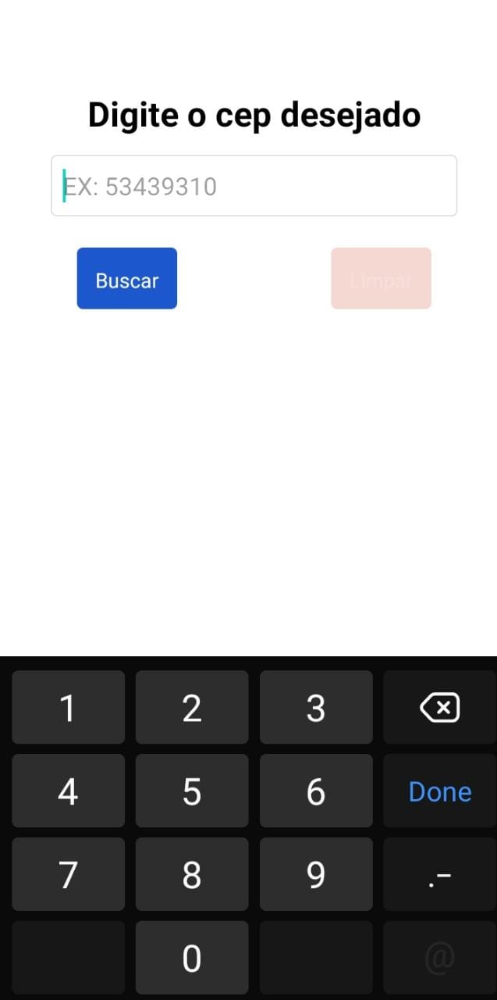

# Aplicativo Buscador de Cep

<!---Esses são exemplos. Veja https://shields.io para outras pessoas ou para personalizar este conjunto de escudos. Você pode querer incluir dependências, status do projeto e informações de licença aqui--->


<p float="left">





<p/>

> O aplicativo desenvolvido com React-Native e javascript Busca ceps e consulta o endereço do Cep Fornecido.
## 💻 Pré-requisitos

Antes de começar, verifique se você atendeu aos seguintes requisitos:
<!---Estes são apenas requisitos de exemplo. Adicionar, duplicar ou remover conforme necessário--->
* Você instalou a versão mais recente de `<Expo Go / Node.js / axios / React-Native / NPM>`
* Compatível com `<Windows / Linux / Mac>`.


## 🚀 Instalando <Buscador_Cep>

Para instalar o <Buscador_Cep>, siga estas etapas:

Linux, macOS e Windows:
```bash
# Clone este repositório
$ git clone https://github.com/Mateusfpfeitosa/Buscador_Cep.git
# Instale as dependências
$ npm install ou yarn
# Execute a aplicação
$ npm run dev ou yarn dev
```

## 📫 Contribuindo para <Buscador_Cep>
<!---Se o seu README for longo ou se você tiver algum processo ou etapas específicas que deseja que os contribuidores sigam, considere a criação de um arquivo CONTRIBUTING.md separado--->
Para contribuir com <Buscador_Cep>, siga estas etapas:

1. Bifurque este repositório.
2. Crie um branch: `git checkout -b <nome_branch>`.
3. Faça suas alterações e confirme-as: `git commit -m '<mensagem_commit>'`
4. Envie para o branch original: `git push origin <nome_do_projeto> / <local>`
5. Crie a solicitação de pull.

Como alternativa, consulte a documentação do GitHub em [como criar uma solicitação pull](https://help.github.com/en/github/collaborating-with-issues-and-pull-requests/creating-a-pull-request).


[⬆ Voltar ao topo](https://github.com/Mateusfpfeitosa/Buscador_Cep.git)<br>
